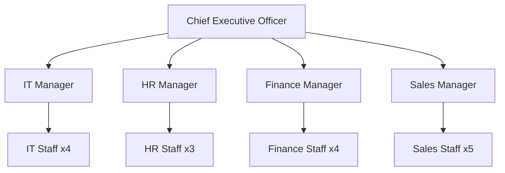

# Enterprise Infrastructure Plan
## ABC Startup Solutions

**Course:** ITEP 414 – System Administration and Maintenance
**Program:** Bachelor of Science in Information Technology
**Project:** Week 2 Portfolio Project – Enterprise Infrastructure Planning for a Startup Company
**Prepared by:** Charles Gabrielle Banagan
**Section:** BSIT-4B
**Date:** August 17, 2026

---

## Part 1 — Company Profile

| Field | Details |
|---|---|
| **Company Name** | ABC Startup Solutions |
| **Nature of Business** | Custom software development, web & mobile application development, and IT consulting services for small-to-medium enterprises |
| **Company Vision** | To become a leading innovator in software solutions, empowering businesses through reliable, scalable, and secure technology. |
| **Company Mission** | To deliver high-quality, secure, and cost-effective software solutions while fostering a culture of continuous learning, collaboration, and technical excellence. |
| **Office Location (fictional)** | 4th Floor, Innovate Business Center, National Highway, Los Baños, Laguna, Philippines 4030 |
| **Total Employees** | 20 |

### Organizational Structure

### Employee Distribution

| Department | Employees |
|---|---|
| Information Technology | 5 |
| Human Resources | 4 |
| Finance | 5 |
| Sales | 6 |
| **TOTAL** | **20** |

---

## Part 2 — Enterprise Hardware Inventory

| Asset ID | Hardware | Quantity | Department | Purpose |
|---|---|---|---|---|
| AST-001 | Desktop Computer | 3 | IT | Server administration, helpdesk support, network monitoring |
| AST-002 | Desktop Computer | 4 | Human Resources | Employee records, payroll processing, recruitment tasks |
| AST-003 | Desktop Computer | 5 | Finance | Accounting, invoicing, financial reporting |
| AST-004 | Desktop Computer | 2 | Sales | In-office order processing and CRM data entry |
| AST-005 | Laptop | 2 | IT | Field troubleshooting, on-site network setup, remote server access |
| AST-006 | Laptop | 4 | Sales | Client presentations, on-site meetings, remote work |
| AST-007 | Server (Rack-mounted) | 2 | IT | Primary application/file server + backup/domain controller |
| AST-008 | Router | 1 | IT (Network Infrastructure) | Routes traffic between the LAN and the ISP connection |
| AST-009 | Managed Switch (24-port) | 2 | IT (Network Infrastructure) | Connects departmental workstations, servers, and printers |
| AST-010 | Network Printer | 2 | Shared (HR / Finance / Sales) | Shared document printing and scanning |
| AST-011 | UPS | 2 | IT (Server Room) | Power backup for the server rack and network equipment |
| AST-012 | Wireless Access Point | 2 | IT (Network Infrastructure) | Wi-Fi coverage across the single office floor |
| AST-013 | NAS Storage | 1 | IT | Centralized file storage and automated backup repository |
| AST-014 | External Backup Drive | 4 | IT / Finance / HR | Offline/offsite backup rotation for critical data |
| AST-015 | Monitor | 15 | All Departments | Display units for desktop workstations (incl. one dual-monitor setup for IT) |

**Justification:** Device counts mirror the 20-employee headcount (14 desktops + 6 laptops = 20), with laptops reserved for roles that require mobility (Sales client visits, IT field support). Two servers provide role separation (application/file vs. backup/domain controller) without over-provisioning for a 20-person company. Redundant switches and UPS units protect against single points of failure in the server room.

---

## Part 3 — Enterprise Software Inventory

| Software | Version | License | Purpose |
|---|---|---|---|
| Windows 11 Pro | 23H2 | Volume License (per device) | Primary OS for desktops/laptops; supports domain join, BitLocker, and Group Policy |
| Ubuntu Server | 22.04 LTS | Open Source (Free) | OS for the primary application/file server — stable, low overhead, well-documented |
| Microsoft Office | 365 Business Standard | Subscription (per user) | Word processing, spreadsheets, email, and collaboration across all departments |
| VS Code | Latest (1.9x) | Free / Open Source | Code editor for IT's scripting, automation, and internal tool development |
| Git | Latest (2.4x) | Free / Open Source | Version control for infrastructure scripts and internal software projects |
| GitHub Desktop | Latest | Free | Simplifies Git repository management for non-CLI users |
| VirtualBox | 7.x | Free / Open Source | Virtualization for testing server configurations and sandboxing |
| Google Chrome | Latest | Free | Primary web browser for daily operations and cloud app access |
| Microsoft Defender | Built-in (Windows 11) | Included with OS | Endpoint antivirus and malware protection for all workstations |
| AnyDesk | Latest | Free / Business License | Remote desktop support tool for the IT helpdesk |
| 7-Zip | 23.x | Free / Open Source | File compression and archiving for backups and file transfers |

---

## Part 4 — Enterprise Network Inventory

| Asset | Specification | Quantity | Purpose |
|---|---|---|---|
| ISP Modem | Fiber modem (up to 500 Mbps) | 1 | Terminates the ISP fiber line and provides internet connectivity |
| Router | Enterprise-grade Gigabit router | 1 | Routes traffic between the internal network and the internet |
| Firewall | Hardware firewall appliance | 1 | Filters inbound/outbound traffic and blocks unauthorized access |
| Switch | 24-port managed Gigabit switch | 2 | Connects wired devices within each department |
| Access Point | Dual-band wireless AP | 2 | Wi-Fi coverage for laptops and mobile devices |
| Patch Panel | 24-port CAT6 patch panel | 1 | Organizes and terminates structured cabling runs |
| CAT6 Cables | Solid CAT6 UTP cable | 300 meters | Wired connections between switches, patch panel, and workstations |
| RJ45 Connectors | CAT6-rated RJ45 | 100 pcs | Terminates CAT6 cable runs into the patch panel and wall jacks |

---

## Part 5 — Enterprise Network Diagram

See [`diagrams/NetworkDiagram.svg`](diagrams/NetworkDiagram.svg) (also embedded in [README.md](README.md)).

The topology follows: **Internet → ISP Modem → Router → Firewall → Core Switch**, which distributes to the **Server, Network Printer, Wireless Access Point**, and the four department segments (**IT, HR, Finance, Sales**).

> **Note:** This diagram was authored as a scalable SVG to guarantee it renders correctly in this repository. Per the assignment requirements, the official submission should also be built in **Draw.io** and exported as both **PNG** and **PDF** — use this SVG as the reference layout when doing so, and place those exports in `diagrams/` alongside it.

---

## Part 6 — System Administration Roles

### Helpdesk Technician
- **Responsibilities:** First-line technical support, hardware/software troubleshooting, ticket management, password/account resets, new-hire device setup.
- **Skills:** Customer service, basic networking, OS troubleshooting (Windows/macOS), clear documentation.
- **Common Tools:** AnyDesk / TeamViewer, ticketing systems (Freshservice, Zendesk), Active Directory Users and Computers.
- **Certifications:** CompTIA A+, CompTIA ITF+, Microsoft Certified: Modern Desktop Administrator Associate.

### Network Administrator
- **Responsibilities:** Designs and maintains the LAN/WAN, configures routers/switches/firewalls, monitors network performance, manages VPNs and Wi-Fi.
- **Skills:** TCP/IP, VLANs, routing protocols, firewall configuration, network monitoring.
- **Common Tools:** Wireshark, PRTG/SolarWinds, Cisco Packet Tracer, pfSense.
- **Certifications:** CompTIA Network+, Cisco CCNA, CompTIA Security+.

### Linux System Administrator
- **Responsibilities:** Manages Linux servers, user/permission management, package and service management, automates tasks with shell scripts, applies security patches.
- **Skills:** Bash scripting, systemd, file permissions, package managers (apt/yum), cron scheduling.
- **Common Tools:** SSH, Bash, Ansible, Nagios/Zabbix.
- **Certifications:** LFCS (Linux Foundation Certified System Administrator), RHCSA, CompTIA Linux+.

### Cloud Administrator
- **Responsibilities:** Manages cloud infrastructure (IaaS/PaaS), provisions VMs and storage, manages cloud backups, optimizes cost, administers cloud IAM.
- **Skills:** Cloud networking, identity and access management, infrastructure-as-code (Terraform), cost monitoring.
- **Common Tools:** AWS Console / Azure Portal / GCP Console, Terraform, CloudWatch / Azure Monitor.
- **Certifications:** AWS Certified Solutions Architect – Associate, Microsoft Certified: Azure Administrator Associate, Google Associate Cloud Engineer.

### How They Work Together
At ABC Startup Solutions, these four roles form a layered support system rather than working in isolation. The **Helpdesk Technician** is the first point of contact for day-to-day employee issues and escalates anything beyond basic troubleshooting. The **Network Administrator** ensures the underlying connectivity — routers, switches, firewall, and Wi-Fi — stays available and secure, which every other role depends on. The **Linux System Administrator** keeps the on-premises server (file storage, backups, internal services) patched, running, and properly permissioned. As the company grows and adopts cloud services for scalability, the **Cloud Administrator** extends that same reliability and security discipline to hosted infrastructure, working closely with the Network Administrator on VPN/hybrid connectivity and with the Linux Administrator on server migration and backup strategy. Together, they cover the full stack from end-user support to network, server, and cloud — with clear escalation paths preventing any single point of failure in the company's IT support model.

---

## Part 7 — Infrastructure Recommendations

- **Internet Provider:** A business-grade fiber ISP (e.g., PLDT Enterprise or Converge ICT Business) with an SLA-backed connection of at least 300–500 Mbps symmetrical, plus a secondary LTE/backup line for failover during outages.
- **Server Specifications:** A rack-mounted server in the Dell PowerEdge T340/R340 class — Intel Xeon E-2300 series CPU, 32–64 GB ECC RAM, RAID 1/5 across 2–4 SSDs, redundant power supply — running Ubuntu Server 22.04 LTS, virtualized to host file server, domain services, and backup roles on shared hardware.
- **Backup Strategy:** Follow the **3-2-1 rule** — 3 copies of data, on 2 different media types (NAS + external drive), with 1 copy offsite/cloud. Automated nightly incremental backups plus a weekly full backup.
- **Security Recommendations:** Hardware firewall with IDS/IPS, VLAN segmentation per department, VPN for remote access, scheduled patch management, and periodic employee security-awareness training.
- **Antivirus:** Microsoft Defender for Business, centrally managed, supplemented by scheduled full-system scans across all endpoints.
- **Password Policy:** Minimum 12 characters combining uppercase, lowercase, numbers, and symbols; mandatory rotation every 90 days; MFA required for email and admin accounts; account lockout after 5 failed attempts; no reuse of the last 5 passwords.
- **Expansion Plan:** Provision the network with a /24 subnet (254 usable addresses) and ~20% spare switch ports to accommodate near-term hiring; leave modular rack space in the server room for additional servers; size Wi-Fi AP coverage for future desks; design with a hybrid-cloud path in mind so services can shift to the cloud as headcount grows past ~50 employees.

---

## Part 8 — Personal Reflection

Working through this Enterprise Infrastructure Plan gave me a much more concrete sense of what "planning" actually means in system administration. Going in, I assumed the hard part of setting up a company's IT would be the technical configuration — installing servers, wiring switches, setting up firewalls. What this project showed me instead is that the hardest and most important work happens *before* any of that: understanding how many people are in each department, what they actually do all day, and translating that into a realistic list of hardware, software, and network equipment that the business can justify buying.

The most challenging part for me was the hardware and network inventory. It's easy to just list "20 desktops, 1 server, 1 router" and call it done, but the assignment pushed me to actually reason about *why* each department needed what it needed — why Sales gets laptops instead of desktops, why the server room needs redundant UPS units, why a 20-person company still benefits from VLAN segmentation. Justifying those choices forced me to think like the Junior System Administrator described in the scenario, not just like a student filling out a table.

Designing the network diagram was the second major challenge. Mapping the logical flow from the internet down through the modem, router, firewall, and switch, and then out to each department, made me appreciate how a badly planned network topology can create bottlenecks or security gaps that are invisible until something breaks. It also reinforced why documentation matters — a diagram that only makes sense to the person who drew it isn't useful to a team.

This project drove home why planning has to come before deployment. If ABC Startup Solutions bought hardware first and figured out the network second, they'd likely end up with mismatched equipment, insufficient cabling, or a network that can't scale past its first year. Planning lets a System Administrator catch those problems on paper, where they're cheap to fix, instead of after the equipment is already installed.

Overall, this exercise pushed me to think beyond individual tools and toward infrastructure as a system — hardware, software, network, security policy, and people all depending on each other. That systems-level thinking, plus the practice of documenting technical decisions clearly enough for a non-technical manager to approve them, is exactly the skill set I'll need whether I end up as a Network Administrator, a Linux Administrator, or a Cloud Administrator down the line.

---

## References
See [`references/references.md`](references/references.md).
