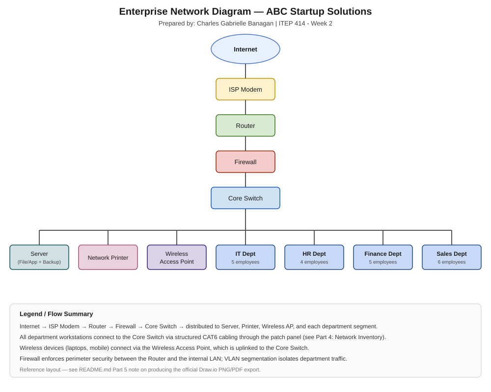

# Week 02 - System Administration Portfolio
# Week 2 – Enterprise Infrastructure Planning for a Startup Company

## Student Information
Name: Charles Gabrielle Banagan
Course: Bachelor of Science in Information Technology (BSIT)
Section: BSIT-4B
Date: August 17, 2026

---

## Project Overview
This week's project puts me in the role of a **Junior System Administrator** hired by a newly established 20-person software startup, **ABC Startup Solutions**. The company has no existing computers, servers, network, or security policies. My task was to design its complete IT infrastructure from scratch — hardware, software, networking, and security — and document it in a professional plan suitable for submission to an IT Manager or company executive.

The full plan is documented in [`EnterpriseInfrastructurePlan.md`](EnterpriseInfrastructurePlan.md).

## Learning Objectives
- Explain the roles and responsibilities of a System Administrator.
- Identify the hardware, software, and networking requirements of a small business.
- Describe the purpose of IT documentation and infrastructure planning.
- Analyze organizational IT requirements and prepare professional IT inventories.
- Design an enterprise network topology.
- Create technical documentation using Markdown and present infrastructure planning professionally.

## Company Scenario
**ABC Startup Solutions** is a 20-employee software development company occupying a single office floor, split across four departments:

| Department | Employees |
|---|---|
| Information Technology | 5 |
| Human Resources | 4 |
| Finance | 5 |
| Sales | 6 |
| **TOTAL** | **20** |

The company currently has no computers, server, network, internet infrastructure, or security policies — everything had to be designed from the ground up. Full details are in [Part 1 of the Plan](EnterpriseInfrastructurePlan.md#part-1--company-profile).

## Hardware Inventory Summary
15 hardware asset types were provisioned, sized to the 20-person headcount: 14 desktops + 6 laptops (one device per employee, laptops reserved for mobile roles in IT and Sales), 2 servers, 1 router, 2 managed switches, 2 network printers, 2 UPS units, 2 wireless access points, 1 NAS, 4 external backup drives, and 15 monitors.

See the full table with Asset IDs, quantities, and justifications: [Part 2 — Enterprise Hardware Inventory](EnterpriseInfrastructurePlan.md#part-2--enterprise-hardware-inventory).

## Software Inventory Summary
Core software stack: **Windows 11 Pro** (workstations), **Ubuntu Server 22.04 LTS** (primary server), **Microsoft 365** (productivity), **VS Code / Git / GitHub Desktop** (IT development tooling), **VirtualBox** (testing/sandboxing), **Google Chrome** (browsing), **Microsoft Defender** (endpoint protection), **AnyDesk** (remote support), and **7-Zip** (archiving).

See the full table with versions, licenses, and purpose: [Part 3 — Enterprise Software Inventory](EnterpriseInfrastructurePlan.md#part-3--enterprise-software-inventory).

## Embedded Network Diagram

**Flow:** Internet → ISP Modem → Router → Firewall → Core Switch → Server / Network Printer / Wireless Access Point / IT / HR / Finance / Sales department segments.

> The official Draw.io PNG and PDF exports (per assignment requirements) should be added to `diagrams/` alongside this reference diagram once completed in Draw.io.

## Technologies Used
- **Markdown** — technical documentation (this README and the infrastructure plan)
- **Mermaid** — organizational structure diagram
- **SVG** — network topology diagram
- **Git & GitHub** — version control and portfolio hosting
- **Draw.io** *(pending)* — official network diagram export

## Challenges Encountered

1. **Balancing realism with a fictional scope**
   Problem: Deciding realistic hardware/software quantities for a company that doesn't actually exist required grounding every number in the given employee counts rather than guessing arbitrarily.
   Solution: Built every quantity directly off the 20-employee, 4-department breakdown (e.g., desktops + laptops summing exactly to headcount) so each inventory line is traceable and defensible.

2. **Representing a network diagram without native diagramming software in this workflow**
   Problem: The assignment calls for a Draw.io-built PNG/PDF diagram, but I needed a diagram that renders directly inside the GitHub repository for the README.
   Solution: Authored the topology as a scalable SVG that renders natively on GitHub, documented as a reference layout, with a clear note to also complete and add the official Draw.io PNG/PDF exports.

3. **Keeping empty deliverable folders tracked in Git**
   Problem: Git does not track empty directories (`diagrams/`, `images/`, `references/`), a lesson carried over from Week01.
   Solution: Added placeholder files (`.gitkeep`) to `images/` until screenshots are added, and populated `diagrams/` and `references/` with real content immediately.

## Reflection
Working through this Enterprise Infrastructure Plan gave me a much more concrete sense of what "planning" actually means in system administration — the hardest and most important work happens *before* any configuration, in translating department headcounts and business needs into a defensible hardware, software, and network plan. The hardware/network inventory and the network diagram were the most challenging parts, since they required reasoning about *why* each choice was made rather than just filling in a table. This project reinforced why planning must come before deployment: catching mismatched equipment or scaling gaps on paper is far cheaper than discovering them after purchase. It pushed me to think about infrastructure as an interconnected system — hardware, software, network, and security policy all depending on one another — which is exactly the systems-level thinking a System Administrator needs.

Full 300–500 word reflection: [Part 8 — Personal Reflection](EnterpriseInfrastructurePlan.md#part-8--personal-reflection).

## References
Full source list: [`references/references.md`](references/references.md).

Key sources: Cisco Networking Basics, Microsoft Learn (Windows 11, Defender for Business), Ubuntu Server Docs, CompTIA Certifications, Linux Foundation (LFCS), Red Hat (RHCSA), AWS/Azure/Google Cloud certification pages, NIST Digital Identity Guidelines, and the LSPU ITEP 414 Week 2 course module (Penaredondo, J.R.M.).
